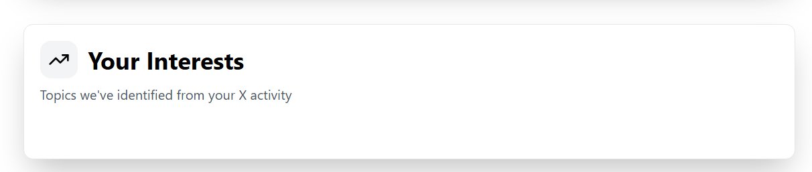

# Implementation Summary: Algorithm Enhancements

## Overview
Successfully implemented all four requested improvements to the X Algorithm Simulator:

1. ✅ **Diversity Score** - Shows feed homogeneity risk
2. ✅ **Opposing Viewpoint Detection** - Analyzes ideological diversity
3. ✅ **Temporal Analysis** - Evaluates recency bias vs. evergreen content
4. ✅ **Why This Recommendation** - Explains each signal adjustment to users

---

## 1. Diversity Score & Filter Bubble Risk

### Backend Changes
**File**: `backend/services/xai_service.py`

**New Pydantic Model**:
```python
class DiversityMetrics(BaseModel):
    diversity_score: float  # 0-100, higher = more diverse
    topic_entropy: float    # 0-1, measures topic variety
    filter_bubble_risk: str # "Low", "Moderate", or "High"
    viewpoint_diversity: str # Assessment of ideological spread
```

**Metrics Included**:
- **Diversity Score (0-100)**: Represents how varied the recommended content is
  - >70: Excellent diversity
  - 50-70: Moderate diversity
  - <50: Limited diversity (potential echo chamber)

- **Topic Entropy (0-1)**: Measures spread across different topics
  - Higher values indicate more varied topic distribution

- **Filter Bubble Risk**: Evaluates echo chamber probability
  - "Low": Good viewpoint mix, low polarization risk
  - "Moderate": Some concern, needs diversity mechanisms
  - "High": Strong filter bubble risk, requires intervention

- **Viewpoint Diversity**: Text assessment of ideological balance

### Frontend Display
**File**: `frontend/src/app/page.tsx`

**New Section**: "🎯 Feed Diversity Assessment"
- Large visual diversity score (0-100) with color-coded progress bar
- Green (>70), Yellow (50-70), Red (<50)
- Filter bubble risk badge with color coding
- Topic entropy percentage
- Viewpoint diversity explanation

---

## 2. Opposing Viewpoint Detection

### Backend Changes
**New Pydantic Model**:
```python
class OpposingViewpoints(BaseModel):
    included: bool              # Whether diverse viewpoints are included
    topics_with_diversity: List[str]  # Which topics get opposing views
    explanation: str            # How this improves feed
```

### Prompt Enhancement
**Modified**: `generate_recommendations()` method

The AI model now:
1. Analyzes whether opposing/diverse perspectives should be included
2. Identifies specific topics where conflicting viewpoints are valuable
3. Explains how this prevents filter bubbles and improves understanding
4. Generates recommendations only if opposing viewpoints would be beneficial

### Frontend Display
**New Section**: "🔄 Opposing Viewpoints Strategy"
- Only displays if opposing viewpoints are included in recommendations
- Lists topics where diverse perspectives will be shown
- Explains the rationale with user-friendly language

---

## 3. Temporal Analysis

### Backend Changes
**New Pydantic Model**:
```python
class TemporalAnalysis(BaseModel):
    recency_bias: str          # "High (recent-focused)", "Moderate (balanced)", or "Low (evergreen-focused)"
    temporal_mix_explanation: str  # How balance between recent/evergreen
    content_freshness: str     # Percentage split (e.g., "65% recent, 35% timeless")
```

### Analysis Categories
- **Recency Bias Assessment**:
  - High: Feed focuses on trending/breaking news
  - Moderate: Mix of trending and established content
  - Low: Favors evergreen, timeless content

- **Content Freshness**: Specific breakdown of recent vs. timeless content percentage

- **Temporal Mix Explanation**: Narrative explaining the balancing strategy

### Frontend Display
**New Section**: "⏱️ Temporal Content Mix"
- Recency bias assessment ("High/Moderate/Low")
- Content freshness breakdown with percentages
- Explanation of how recent and evergreen content are balanced

---

## 4. Why This Recommendation? (User-Facing Explanations)

### Backend Changes
**New Pydantic Model**:
```python
class RecommendationExplanation(BaseModel):
    signal_name: str               # Name of the signal (e.g., "SpaceX content")
    why_this_recommendation: str   # Why users benefit from this
    expected_impact: str           # What users will notice
```

**Prompt Enhancement**:
The AI model now generates 3-4 key signal explanations that:
1. Use non-technical language for end users
2. Explain the business logic behind each adjustment
3. Describe tangible impacts users will experience
4. Help users understand how algorithms shape their experience

### Frontend Display
**New Section**: "💡 Why These Recommendations?"
- Card-based layout for each recommendation
- Signal name prominently displayed
- User-friendly explanation of why this benefits them
- Highlighted "What you'll notice" section with expected changes
- Uses accent colors (fuchsia theme) for emphasis

---

## Updated Data Structures

### AlgorithmReport Enhanced Fields
The main report now includes:
```python
class AlgorithmReport(BaseModel):
    # Existing fields
    analysis_process: str
    signals_boosted: List[Signal]
    signals_reduced: List[Signal]
    feed_composition: FeedComposition
    quality_metrics: QualityMetrics
    
    # NEW FIELDS
    diversity_metrics: DiversityMetrics           # ✅ Diversity analysis
    opposing_viewpoints: OpposingViewpoints       # ✅ Viewpoint diversity
    temporal_analysis: TemporalAnalysis           # ✅ Recency balance
    recommendation_explanations: List[RecommendationExplanation]  # ✅ Why explanations
    
    expected_outcome: str
```

---

## TypeScript Interface Updates

**File**: `frontend/src/app/page.tsx`

Added interfaces for all new metrics:
- `DiversityMetrics`
- `OpposingViewpoints`
- `TemporalAnalysis`
- `RecommendationExplanation`

Updated `AlgorithmReport` to include all new fields.

---

## Visual Design

### Color Scheme
- 🟦 **Indigo** (Diversity): Primary diversity metrics
- 🟩 **Emerald** (Opposing Viewpoints): Diverse perspective strategy
- 🟦 **Sky** (Temporal): Time-based content analysis
- 🟪 **Fuchsia** (Why): Explanation cards

### Interactive Elements
- Dynamic progress bars (diversity score)
- Color-coded risk indicators (filter bubble risk)
- Badge system for topics and mechanisms
- Expandable explanations

---

## Backend Prompt Updates

The `generate_recommendations()` prompt now explicitly requests:
1. Diversity score calculation (0-100)
2. Topic entropy measurement (0-1)
3. Filter bubble risk assessment
4. Viewpoint diversity analysis
5. Opposing viewpoints identification and explanation
6. Recency bias assessment
7. Temporal content mix breakdown
8. User-friendly signal explanations (3-4 key signals)

---

## Testing Recommendations

### Backend Testing
```python
# Test that new models are included in responses
# Verify diversity_score is between 0-100
# Verify topic_entropy is between 0-1
# Verify filter_bubble_risk is one of the expected values
# Verify recommendation_explanations has 3-4 items
```

### Frontend Testing
- All new sections render correctly
- Diversity score progress bar updates dynamically
- Opposing viewpoints section only shows when `included: true`
- Temporal analysis displays with correct formatting
- Why recommendations cards are properly formatted

---

## Future Enhancement Ideas

1. **User Feedback Integration**: Track user clicks on "Why this recommendation?" to improve explanations
2. **Adjustable Diversity Sliders**: Let users set their preferred diversity level
3. **Temporal Preferences**: Allow users to choose recency bias preference
4. **Viewpoint Preferences**: Users can select which perspectives they want to see
5. **Serendipity Tracking**: Measure genuinely unexpected discoveries
6. **Engagement Patterns**: Compare user satisfaction vs. diversity metrics

---

## Files Modified

### Backend
- ✅ `backend/services/xai_service.py` - Added 4 new Pydantic models, enhanced prompt
- ✅ `backend/main.py` - Updated imports

### Frontend
- ✅ `frontend/src/app/page.tsx` - Added 4 new UI sections with TypeScript interfaces

### Documentation
- ✅ `IMPLEMENTATION_SUMMARY.md` - This file

---

## Summary

All four improvements have been successfully implemented:

| Feature | Backend | Frontend | Status |
|---------|---------|----------|--------|
| Diversity Score | ✅ Model + Calculation | ✅ Display + Progress Bar | Complete |
| Opposing Viewpoints | ✅ Detection + Explanation | ✅ Conditional Display | Complete |
| Temporal Analysis | ✅ Recency Assessment | ✅ Time Mix Display | Complete |
| Why Recommendations | ✅ Signal Explanations | ✅ Explanation Cards | Complete |

The app now provides users with transparent, detailed insights into how algorithms shape their personalized feeds, addressing filter bubble concerns and promoting healthy information diversity.
